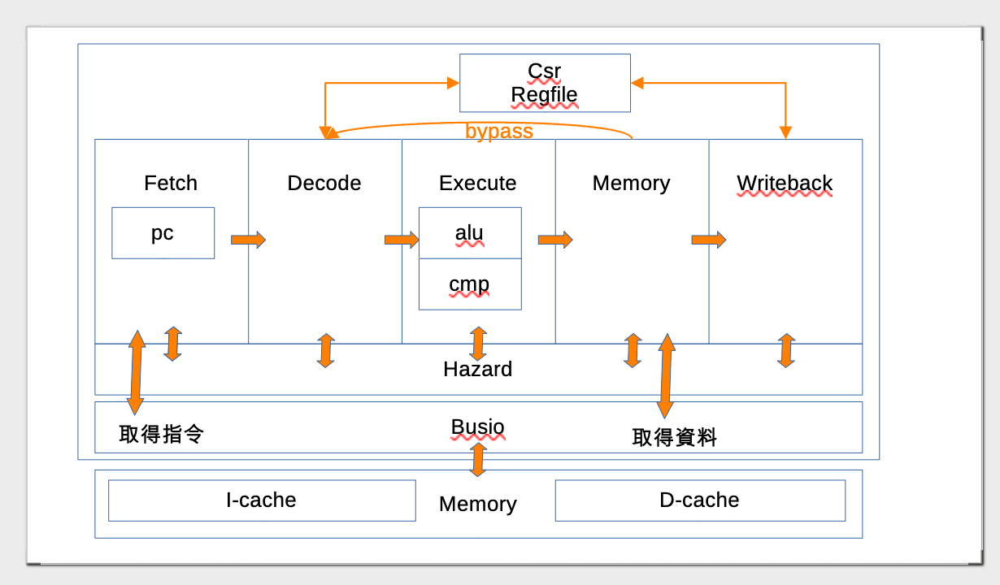

# Kleine-riscv Architecture


1. Kleine-riscv 的 CPU (core.v) 是用 verilog 寫的，放在 src/ 資料夾中，包含經典的 5 階段 pipeline 與 alu/cmp/csr/regfile/hazard/busio 等模組
2. 但是測試模組 testbench 則是用 C++ 寫的，放在 sim/ 資料夾中，像是 core.cpp/hpp, memory.cpp/hpp, simulator.cpp 等
    * 參考 -- https://verilator.org/guide/latest/example_cc.html
3. 測試所需要的機器碼，則是用 .c / .S (C 與組合語言) 寫的，放在 tests 資料夾中


## 整體架構



1. 全部的 hazard 處理都集中給 hazard.v 模組
2. hazard 和 5 階段都有互通，主要是根據各階段回報的訊息，彙整決定 stall (停頓) 與 valid （是否有效）/invalidate（撤回） 
3. 五階段管線，前面的會傳給後面，通常後面不會傳給前面
    * Fetch => Decode => Execute => Memory => Writeback
4. 透過 busio 處理對指令快取，資料快取，與外部記憶體的存取事宜。
    * 記憶體的存取，由 Verilator 的 cpp 模組進行互動，所以不在 Verilog 的管轄，沒有對應的 *.v 檔案。
    * busio 和 Fetch 與 Memory 階段有線路溝通。

## pipeline 的運作

1. Fetch: 根據 reset/trap/mret/branch 或者 正常遞增 pc+=4 來決定下一個 pc 的值
    * 送出 instruction 給 Decode
    * 透過  fetch_address 丟要取的指令位址給 busio，然後從 fetch_data 取得回來的指令。（丟出 address 後，不一定多久會回傳 data，因為要看指令記憶體 hit 的情況，而且這次丟位址，下次才會取回來）
2. Decode: 根據 instruction 的 op 決定要設定 ALU 與 CMP 為何種運算
    * 送出 (rs1, rs2) address 給 regfile 取得暫存器內容
    * 送出 (csr_address) 給 csr 取得特殊暫存器內容。
    * 是否跳轉 (jump) 等等。
3. Execute: 裡面包含 ALU/CMP 兩個運算元件，真正執行運算並取得結果
    * 若沒 stall，則送出 pc, rs2, csr, branch, jump, load, store, write, mret, wfi 等訊號給下一階段。 
4. Memory: 決定是否更新 PC/CSR/Regfile/Memory/mret/wfi，以及是否 branch (=> hazard)
    * 透過 mem_address 發出資料位址，將 mem_store_data 中的資料寫入記憶體，或者從 mem_load_data 中讀取資料。
5. Writeback: 執行 CSR/Regfile[rd] 的寫入動作，還有處理中斷 interrupt 並設定中斷原因 ecause
    * 對 fetch、csr 和 hazard 模組的輸出 trap/mret 訊號


## ALU in Execute

```verilog
// 實例化 ALU 模組
alu ex_alu (
    .clk(clk), // 時鐘信號
    .input_a(alu_input_a), // ALU 輸入 A
    .input_b(alu_input_b), // ALU 輸入 B
    .function_select(alu_function_in), // ALU 功能選擇
    .function_modifier(alu_function_modifier_in), // ALU 功能修飾符
    .add_result(alu_addition_out), // ALU 加法結果
    .result(alu_data_out) // ALU 最終結果
);
```

## CMP in Execute

```verilog
// 實例化比較器模組
cmp ex_cmp (
    .clk(clk), // 時鐘信號
    .input_a(acctual_rs1), // 輸入 A
    .input_b(acctual_rs2), // 輸入 B
    .function_select(cmp_function_in), // 比較功能選擇
    .result(cmp_output_out) // 比較結果輸出
);
```

